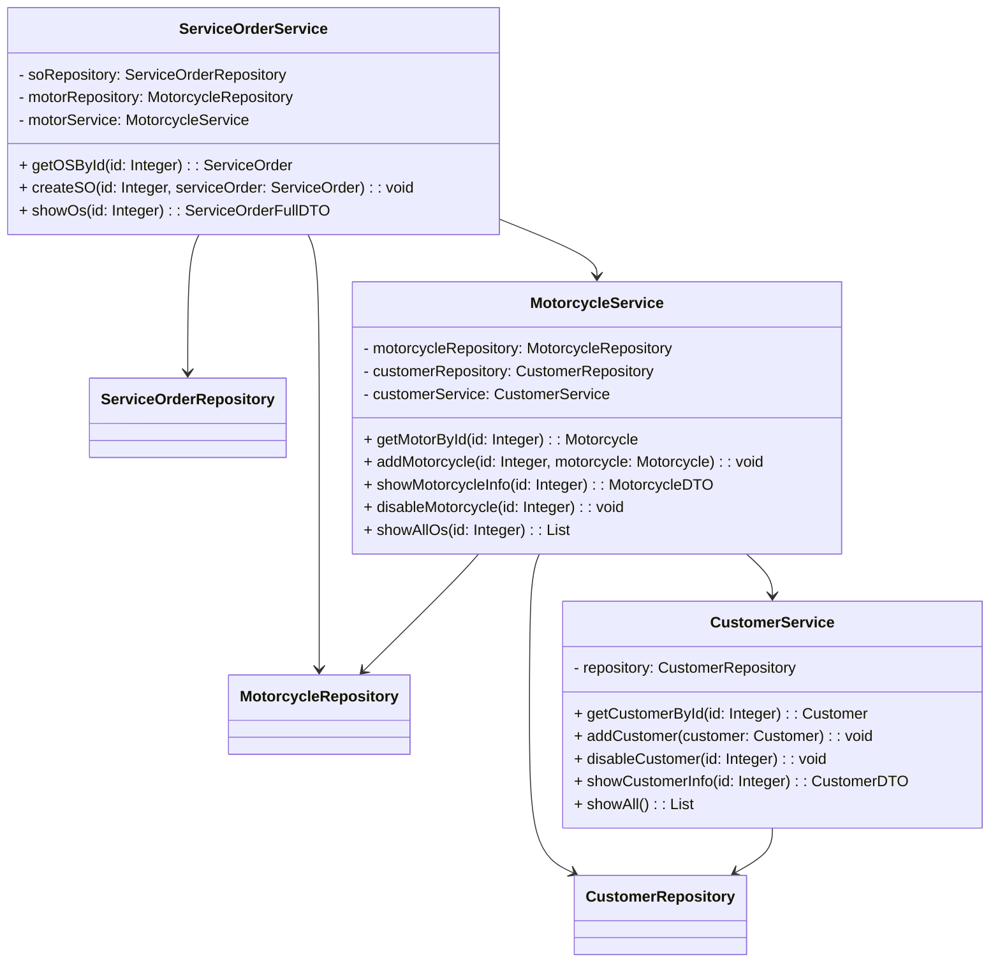
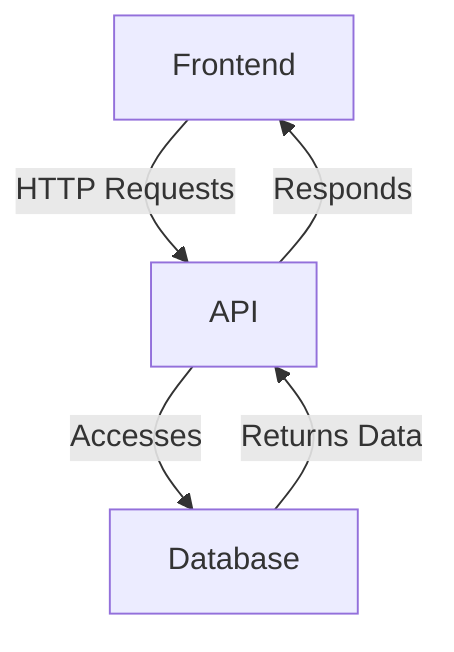

# Service Order System

This project is a simplified system to manage **Customers, Motorcycles, and Service Orders**.

### System Rules:
- A **Customer** can have **N** motorcycles.
- A **Motorcycle** belongs to **only one** owner but can have **N** service orders.
- Each **Service Order** is linked to **one** motorcycle.

---

## Technologies Used

### Backend
- **Java** + **Spring Boot**
- **Maven** for dependency management
- **Swagger** for API documentation
- **MySQL** as the database

### Frontend
- **React** + **TypeScript**
- **Vite** for optimized build
- **TailwindCSS** for styling

## Project Structure

### Backend (API)
```plaintext
src/
└── main/
    └── java/com/so/system/
        ├── config/
        ├── controller/
        ├── dtos/
        ├── model/
        ├── repository/
        └── service/
```

The backend provides REST endpoints to manage customers, motorcycles, and service orders.

### Frontend
The frontend is a React application that makes HTTP requests to the API, allowing interaction with the data.

### Class Diagram


### System Diagram

